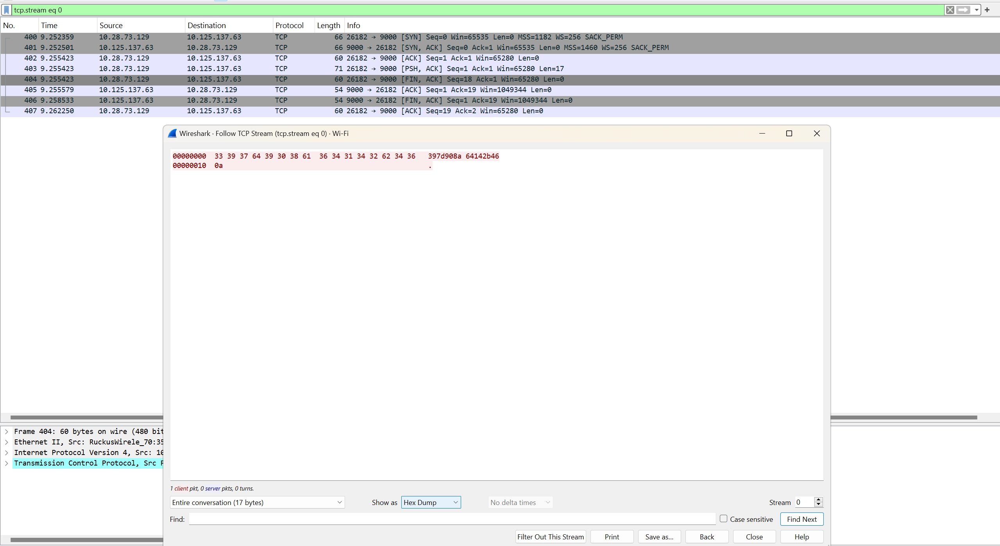

# Encryption and Dectryption Transmission with Caesar Cipher and One Time Pad 

How to Run :

Set up Receiver and Sender 

Init package (if u havent) :

```
go mod init
```

### Receiver 

Listen on some port, example :

```
go run .\caesar\main.go -mode=receiver -addr=:9000 -shift=3
```

```
go run .\one-time-pad\main.go -mode=receiver -addr=:9000
```

### Sender 

Fill all the flag, for example :

```
go run .\caesar\main.go -mode=sender -addr="127.0.0.1:9000" -shift=3
```

```
go run .\one-time-pad\main.go -mode=sender -addr="127.0.0.1:9000"
```

You will prompted to input the text, and send those text by press `enter`


### How To Run

Find the address of receiver computer/devices. This can be done with :

```
// from receiver device
hostname -I
```

to test :

```
ping <<IP_ADDRESS>>
```

in Ubuntu, (I use VM because it's much more simple)

after that, use above instructions on receiver and sender to send and receive the message


## DES

How to play :

- Cek receiver ip with ipconfig, make sure on "wireless LAN adapter Wi-Fi" option, ipv4 :

- Example :

```
Receiver:
go run ./des -mode=receiver -addr=":9000" -key="133457799BBCDFF1" -block-mode=cbc -padding=pkcs7 -iv="0102030405060708"
```

```
Sender:
go run ./des -mode=sender -addr="10.125.137.63:9000" -key="133457799BBCDFF1" -block-mode=cbc -padding=pkcs7 -iv="0102030405060708"
```

### Hasil Wireshark




